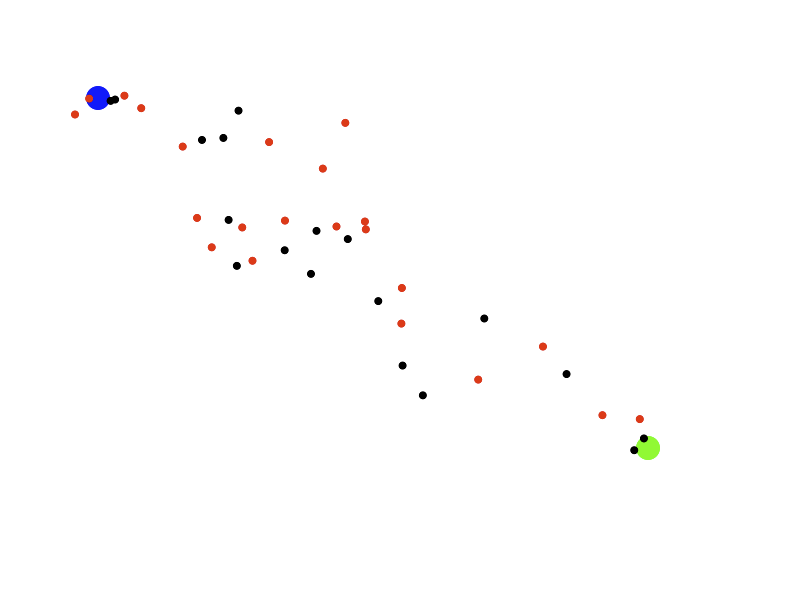

# EP2 Aufgabenblatt 1.3

Kernthemen: Datenabstraktion mit linearer und assoziativer Datenstruktur über Arrays (siehe Skriptum Seiten 46-59)

## Organisatorisches

Abgabe-Deadline: **24.3.2026, 13:00 Uhr**  
Art der Abgabe: `git commit` & `git push`

### Allgemeine Hinweise

* Die Lösung muss im vorgegebenen Projekt und somit in den vorhandenen Dateien erfolgen.
* Sie dürfen zur Lösung dieser Aufgabe *nicht* auf das Java Collections Framework zurückgreifen.
* Verändern Sie keine der vorgegebenen Methodensignaturen.
* Alle Objektvariablen und etwaige von Ihnen zusätzlich erstellte Methoden in vorgegebenen
  Klassen müssen `private` sein.
* Achten Sie darauf, dass Ihre Abgabe ausführbar ist.
* Hinweise und zu bearbeitende Stellen sind im Code mit `TODO` gekennzeichnet.

---

## Informationen zur Domäne

### Ameisen suchen Futter

In dieser Simulation bewegen sich mehrere Ameisen in einer zweidimensionalen Welt.

Die Welt enthält eine Nestposition, eine Futterquelle und die Ameisen. Alle Ameisen starten beim Nest.  
Sie bewegen sich zufällig durch die Welt, bis sie die Futterquelle finden. Sobald eine Ameise Futter gefunden hat,
kehrt sie zum Nest zurück. Dabei nutzt sie den gespeicherten Hinweg zur Futterquelle als Rückweg zum Nest.

Diese Simulation muss *nicht* dem Ant-Colony-Optimization-Algorithmus (ACO) entsprechen, sondern kann möglichst 
einfach implementiert werden. Ein Großteil der Klasse `Ant` ist zur Orientierung bereits vorgegeben, 
diese darf aber auch angepasst werden (siehe Denkanstöße).

Im Zentrum der Aufgabe steht die Implementierung und die Nutzung der Datenstrukturen `AntQueue`, `Vector2DStack` und 
`Vector2DAntMap`.
---

### Bewegungsverhalten der Ameisen

Eine Ameise kann sich in zwei Zuständen befinden:

1. Suche nach Futter: Die Ameise bewegt sich in zufälliger Richtung durch die Welt.  
   Dabei speichert sie jede besuchte Position in einem Stack.

2. Rückkehr zum Nest: Nachdem Futter gefunden wurde, läuft die Ameise den gespeicherten Weg
   in umgekehrter Reihenfolge zurück. Dadurch entsteht eine einfache Form von Gedächtnis mithilfe einer Datenstruktur.

---

## Aufgabenstellung

Dieses Aufgabenblatt besteht aus drei Teilaufgaben:

1. Datenstrukturen implementieren (`Vector2DStack`, `AntQueue`, `Vector2DAntMap`)
2. Klassen `World` und `Ant` implementieren
3. Simulation mit `ApplicationAnt` visualisieren

Die zu bearbeitenden Dateien sind:

* [Vector2DStack.java](../src/Vector2DStack.java)
* [AntQueue.java](../src/AntQueue.java)
* [Vector2DAntMap.java](../src/Vector2DAntAssoc.java)
* [World.java](../src/World.java)
* [Ant.java](../src/Ant.java)
* [ApplicationAnt.java](../src/ApplicationAnt.java)

Die folgenden Klassen sind bereits vollständig gegeben:

* [Vector2D.java](../src/Vector2D.java)
* [State.java](../src/State.java)
* [ApplicationTest.java](../src/ApplicationTest.java)

Diese Dateien [Vector2D.java](../src/Vector2D.java) und [State.java](../src/State.java) dürfen nicht verändert werden. 
Die Klasse [ApplicationTest.java](../src/ApplicationTest.java) können Sie zum Testen der
Datenstrukturen ([AntQueue.java](../src/AntQueue.java), [Vector2DStack.java](../src/Vector2DStack.java), [Vector2DAntMap.java](../src/Vector2DAntAssoc.java)) 
verwenden. Bei einer fehlerfreien Implementierung sollten bei der Ausführung dieser Klasse 
keine Ausnahmen (Exception) ausgelöst werden und alle Testfälle "OK" ausgegeben. Sie müssen diese Klasse nicht 
verändern, können aber eigene Testfälle hinzufügen.

---

### Teilaufgabe 1 – Datenstrukturen implementieren

In dieser Aufgabe implementieren Sie drei grundlegende Datenstrukturen. Vervollständigen Sie dazu die Klassen
`Vector2DStack`, `AntQueue` und `Vector2DAntMap` gemäß den Kommentaren in den entsprechenden Dateien.
Diese Datenstrukturen werden später in der Simulation verwendet. Orientieren Sie sich dabei an den Beispielen im 
Skriptum auf Seiten 46-59. Testen Sie die Implementierungen mit [ApplicationTest.java](../src/ApplicationTest.java).

---

### Teilaufgabe 2 – Klassen `World` und `Ant`

Nun wird die eigentliche Simulation implementiert. Vervollständigen Sie dazu die Klassen
`World` und `Ant` gemäß den Kommentaren in den entsprechenden Dateien.

---

#### Verhalten von `step()`

Halten Sie sich immer möglichst genau an die Spezifikation. Während diese bei den Klassen `Vector2DStack`, `AntQueue`
und `Vector2DAntMap` kaum Spielraum lässt, bleibt bei `Ant` und `World` einiges offen, und Sie haben hier einige Freiheiten.
Eine mögliche Implementierung von [Ant.java](../src/Ant.java) ist bereits großteils vorgegeben. Sie können diese vervollständigen 
oder ändern. Die Ameise soll sich grob wie im Folgenden beschrieben verhalten.

Wenn die Ameise kein Futter trägt:

* wird die Bewegungsrichtung durch eine Kombination aus Zufallsvektor und Richtungsvektor, der zur
  Futterquelle zeigt (Geruchssinn), bestimmt.
  Es steht Ihnen frei, weitere Komponenten zu addieren
  (z. B. Trägheit, gleitender Mittelwert der letzten Schritte).
* speichert die Ameise die aktuelle Position im Stack.
* prüft die Ameise, ob das Futter erreicht wurde (Distanz kleiner als bestimmter Wert).

Wenn die Ameise Futter trägt:

* läuft sie den Weg zurück, indem sie die Positionen aus dem Stack holt (Richtung muss nicht berechnet werden).
* prüft sie, ob das Nest erreicht wurde.

---

### Teilaufgabe 3 – `ApplicationAnt`

Erstellen Sie in der vorgegebenen Klasse [ApplicationAnt.java](../src/ApplicationAnt.java) die `main`-Methode. Diese
erzeugt eine bestimmte Anzahl an Ameisen, verwaltet diese in einem `AntQueue`-Objekt und enthält eine
Schleife, in der der Status der Ameisen durch Aufruf von `step()` aktualisiert wird. Die in `ApplicationAnt` 
vordefinierten Variablen sind als Anregung gedacht. Sie können Sie nutzen, aber auch löschen oder ändern.

Die Visualisierung der Ameisen soll mittels `CodeDraw` erfolgen und könnte beispielsweise wie in der Abbildung gezeigt
aussehen. Hier werden Ameisen auf Futtersuche und Ameisen auf dem Rückweg farblich unterschieden.

---

# Denkanstöße

* Wie vergleichen Sie in `Vector2DAntMap` die Schlüssel bei der Suche nach dem Eintrag? Nutzen Sie einen
  Referenzvergleich oder vergleichen Sie die Koordinaten? Was ist günstiger, und worauf ist dabei zu achten?
* Wie vergleichen Sie Werte bei `containsValue`?
* Was müsste sich ändern, wenn Sie anstelle der Klasse `Vector2DAntMap` eine Klasse `AntVector2DMap` nutzen müssten, die
  Schlüssel vom Typ `Ant` mit Werten vom Typ `Vector2D` assoziiert?
* Ameisen, die auf dem Rückweg zum Nest sind, könnten eine Pheromonspur legen. Ameisen, die auf Futtersuche sind,
  könnten ihre Bewegungsrichtung nun zusätzlich nach diesen Pheromonen ausrichten. Dadurch entstehen Ameisenstraßen.
  Pheromone verdampfen mit der Zeit wieder. Wie könnte die Implementierung aussehen? Müsste man die Klasse `World` auch 
  anpassen?