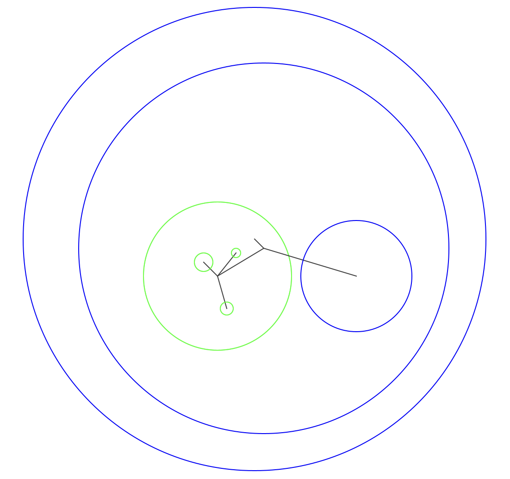

# EP2 Aufgabenblatt 3.1

Kernthemen: Ersetzbarkeit, dynamisches Binden, equals, hashCode, Hash-Tabelle

## Organisatorisches

Abgabe-Deadline: **5.5.2026, 13:00 Uhr**  
Art der Abgabe: `git commit` & `git push`

### Allgemeine Hinweise

* Die Lösung muss im vorgegebenen Projekt und somit in den vorhandenen Dateien erfolgen.
* Sie dürfen zur Lösung dieser Aufgabe *nicht* auf das Java Collections Framework zurückgreifen.
* Verändern Sie weder die vorgegebenen Methodensignaturen noch die Signaturen der Konstruktoren.
* Alle Objektvariablen und etwaige von Ihnen zusätzlich erstellte Methoden oder Konstruktoren in vorgegebenen Klassen
  müssen `private` sein.
* Stellen Sie sicher, dass alle Teile Ihres Projekts kompilierbar und ausführbar sind.
* Hinweise und zu bearbeitende Stellen sind im Code mit `TODO` gekennzeichnet.

---

## Informationen zur Domäne

---

## Aufgabenstellung

Dieses Aufgabenblatt besteht aus drei Teilaufgaben:

1. Vergleich von Implementierungen sowie Anpassung von `PhysicalPhysicalTreeMap`
   und Implementierung von `equals` und `hashCode` in `Physical`-Untertypen
2. Hash-Tabelle `PhysicalPhysicalHashMap`
3. Variante einer Baumstruktur (n-ärer Baum) implementieren (`PhysicalMultiTree`) als Hierarchie von
   `Physical`-Elementen. Dabei werden verschiedene dynamische Knotentypen und dynamisches Binden genutzt.

Die zu bearbeitenden Dateien sind:

* [PhysicalPhysicalTreeMap.java](../src/PhysicalPhysicalTreeMap.java)
* [PhysicalPhysicalTreeMapNode.java](../src/PhysicalPhysicalTreeMapNode.java)
* [PhysicalPhysicalHashMap.java](../src/PhysicalPhysicalHashMap.java)
* [FoodSource.java](../src/FoodSource.java)
* [Nest.java](../src/Nest.java)
* [PhysicalMultiTree.java](../src/PhysicalMultiTree.java)
* [PhysicalMultiTreeNodeLeaf.java](../src/PhysicalMultiTreeNodeLeaf.java)
* [PhysicalMultiTreeNodeInternal.java](../src/PhysicalMultiTreeNodeInternal.java)
* [Vector2D.java](../src/Vector2D.java)

Vervollständigen Sie diese Klassendefinitionen gemäß der Spezifikation in den Dateien. Hinweis: `FoodSource` und `Nest` 
sind Implementierungen von `Physical`. Wir behalten diese Klassen bei, auch wenn `Ant` in AB3.1 nicht mehr vorkommt. 

Die folgenden Interfaces und Klassen sind bereits vollständig gegeben und dürfen grundsätzlich nicht verändert werden:

* [XComparator.java](../src/XComparator.java)
* [Physical.java](../src/Physical.java)
* [PhysicalComparator.java](../src/PhysicalComparator.java)
* [PhysicalPhysicalMap.java](../src/PhysicalPhysicalMap.java)
* [PhysicalMultiTreeNode.java](../src/PhysicalMultiTreeNode.java)
* [PhysicalMultiTreeNodeEmpty.java](../src/PhysicalMultiTreeNodeEmpty.java)
* [PhysicalDoublyLinkedList.java](../src/PhysicalDoublyLinkedList.java)
* [PhysicalDoublyLinkedListNode.java](../src/PhysicalDoublyLinkedListNode.java)

Die Klasse [ApplicationAB3d1.java](../src/ApplicationAB3d1.java) können Sie zum Testen der
Datenstrukturen ([PhysicalPhysicalTreeMap.java](../src/PhysicalPhysicalTreeMap.java), [PhysicalPhysicalHashMap.java](../src/PhysicalPhysicalHashMap.java) 
und [PhysicalMultiTree.java](../src/PhysicalMultiTree.java)) verwenden.
Diese Klasse stellt einige grundlegende Testfälle bereit, die bei Ausführung keine Ausnahmen (`Exception`) auslösen dürfen.
Die Ausführung dieser Testfälle muss mit Ihrer Implementierung zur Ausgabe von "OK" führen. Andernfalls ist Ihre
Implementierung jedenfalls mangelhaft. Beachten Sie jedoch, dass auch dann, wenn alle gegebenen Testfälle "OK" liefern,
dies nicht automatisch bedeutet, dass Ihre Implementierung vollständig korrekt ist. Darüber hinaus dürfen und sollten
Sie eigene Testfälle hinzufügen.

Die Klasse [ApplicationMultiTree.java](../src/ApplicationMultiTree.java) dient als vorgegebene weitere Testklasse
mit graphischer Ausgabe.

---

## Teilaufgabe 1 – Vergleich von Implementierungen, Anpassen von `PhysicalPhysicalTreeMap`

Die vorgegebenen Klassen `PhysicalPhysicalTreeMap` und `PhysicalDoublyLinkedList`
repräsentieren Datenstrukturen, wie Sie sie in Aufgabenblatt 2.3 selbst umgesetzt haben (teilweise mit
anderen Elementtypen). Vergleichen Sie Ihre Implementierung mit diesen Klassen. Welche Unterschiede gibt es?

`PhysicalPhysicalTreeMap` soll nun `PhysicalPhysicalMap` implementieren. Der Typ der Werte wurde zwar angepasst,
dennoch implementiert `PhysicalPhysicalTreeMap` noch nicht korrekt das Interface `PhysicalPhysicalMap`.
Inwiefern verletzt `PhysicalPhysicalTreeMap` trotz Interface-Implementierung das Ersetzbarkeitsprinzip?
Hinweis: Überlegen Sie insbesondere, wie Schlüssel verglichen werden sollten (per Referenz oder mittels `equals`).
Korrigieren Sie die Klasse entsprechend und ändern Sie dabei auch die Kommentare. Achten Sie auch auf die
Implementierung von `equals` und `hashCode` in `Nest` und `FoodSource`. Für die Lösung kann es hilfreich sein,
`equals` und `hashCode` auch in `Vector2D` zu überschreiben.

---

## Teilaufgabe 2 – `PhysicalPhysicalHashMap`

Vervollständigen Sie die Klasse `PhysicalPhysicalHashMap` gemäß der Spezifikation in der Datei. Auch diese Klasse
implementiert `PhysicalPhysicalMap`. Nutzen Sie das Skriptum als Vorlage. Achten Sie jedoch darauf, dass 
in `PhysicalPhysicalHashMap` im Unterschied zum Beispiel im Skriptum `null`-Schlüssel nicht erlaubt sind. 

---

## Teilaufgabe 3 – Spezielle hierarchische Datenstruktur

Vervollständigen Sie die Klasse `PhysicalMultiTree` zur Speicherung von `Physical`-Objekten.  
Diese Klasse repräsentiert einen speziellen n-ären Baum, der die `Physical`-Objekte hierarchisch wie folgt organisiert:

### Grundidee

Jeder Knoten des Baums speichert genau ein `Physical`-Objekt als primäres Element.  
Zusätzlich kann ein Knoten beliebig viele direkte Nachfolger haben.

Die Struktur des Baums ergibt sich aus der geometrischen Beziehung der enthaltenen Kreise:

* Ein Objekt darf als Kind des Elternobjekts gespeichert werden, wenn es vollständig in dessen Kreis enthalten ist.
* Zwei gespeicherte Kreise dürfen sich nur dann schneiden, wenn eine die andere vollständig enthält.
* Partielles Überschneiden zweier Kreise ist in dieser Struktur nicht erlaubt.

Dadurch entsteht eine Hierarchie verschachtelter physikalischer Objekte.  
Die Klasse `ApplicationMultiTree` kann zur Visualisierung der Hierarchie benutzt werden.

Die folgende Abbildung zeigt ein Beispiel, wobei die Mittelpunkte der Kindknoten jeweils mit dem Mittelpunkt des
Elternknotens durch eine Linie verbunden sind. Farben stellen die unterschiedlichen Untertypen von `Physical` dar.

### Ziel

Die Datenstruktur dient dazu, `Physical`-Objekte so zu organisieren, dass die Enthaltenheitsbeziehung
der zugehörigen Kreise in der Baumstruktur sichtbar wird.

Ein neu eingefügtes Objekt soll dabei so in die Hierarchie eingeordnet werden, dass:

* es unter einem vorhandenen Objekt gespeichert wird, wenn es vollständig darin liegt,
* es selbst vorhandene direkte Nachfolger übernehmen kann, wenn diese vollständig in ihm liegen,
* und die Struktur insgesamt mit den geometrischen Beziehungen konsistent bleibt.

### Interface `PhysicalMultiTreeNode`

Nutzen Sie die verschiedenen vorgegebenen Untertypen von `PhysicalMultiTreeNode`. Beispielsweise wird 
ein leerer Baum mit einem Wurzelknoten-Objekt vom Typ `PhysicalMultiTreeNodeEmpty` erzeugt, anstelle `root = null;`.
Nutzen Sie dynamisches Binden, anstelle von bedingten Anweisungen (beispielsweise anstelle von `if (root == null) ...`).

### Hinweise

* Die Klasse `PhysicalMultiTree` arbeitet mit `Physical`-Elementen.
* Die Wurzel repräsentiert das äußerste Objekt der Hierarchie.
* Einfügen kann in bestimmten Fällen zu einer Umstrukturierung eines Teilbaums führen.
* Die Klasse `ApplicationMultiTree` kann zur Visualisierung und zum Testen verwendet werden.

---

## Denkanstöße

* Muss für die Lösung von Teilaufgabe 1 `equals` und `hashCode` in `Vector2D` unbedingt überschrieben werden?
* Welche Struktur entsteht bei einer Folge von konzentrischen Kreisen im `PhysicalMultiTree`?
* Was passiert beim Einfügen eines Objekts, das mehrere bereits vorhandene Objekte vollständig enthält?
* Wie kann sichergestellt werden, dass keine verbotenen (partiellen) Überschneidungen entstehen?
* Welche Fälle müssen beim Einfügen besonders berücksichtigt werden (z. B. Einfügen an der Wurzel, Einfügen zwischen zwei Ebenen)?
* Welche Teilbäume müssen unter Umständen beim Einfügen eines neuen Objekts umgehängt werden?
* Welchen Vorteil bietet die Nutzung des Interfaces `PhysicalMultiTreeNode`?
* Welchen Vorteil hat die Verwendung eines leeren Knotens anstelle von `null`?
* Angenommen Sie möchten auch für `PhysicalPhysicalTreeMap` ein entsprechendes Interface für Knoten definieren, 
  welche Untertypen würden Sie definieren? Was würde durch dynamisches Binden einfacher werden?

