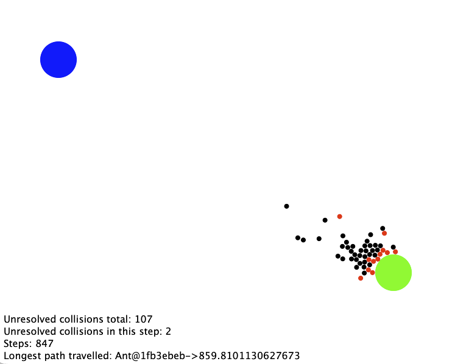

# EP2 Aufgabenblatt 4.2

Kernthemen: Java Collections Framework, Validierung von Eingabedaten, Ausnahmen, Datei-Ein- und Ausgabe (IO)

## Organisatorisches

Abgabe-Deadline: **16.6.2026, 13:00 Uhr**  
Art der Abgabe: `git commit` & `git push`

---

## Allgemeine Hinweise

* Die Lösung muss im vorgegebenen Projekt und somit in den vorhandenen Dateien erfolgen.
* Die Verwendung von Klassen und Interfaces aus dem Java Collections Framework ist in dieser Aufgabe ausdrücklich 
  erlaubt und erwünscht.
* Verändern Sie weder die vorgegebenen Methodensignaturen noch die Signaturen der Konstruktoren.
* Alle Objektvariablen und etwaige von Ihnen zusätzlich erstellte Konstruktoren oder zusätzliche Methoden in 
  vorgegebenen Klassen müssen `private` sein. Ausgenommen davon sind Methoden, die durch ein vorgegebenes Interface
  gefordert sind oder überschriebene öffentliche Methoden.
* Stellen Sie sicher, dass alle Teile Ihres Projekts kompilierbar und ausführbar sind.
* Hinweise und zu bearbeitende Stellen sind im Code mit `TODO` gekennzeichnet.
* Folgen Sie den Prinzipien von Design by Contract. 

---

## Aufgabenstellung

Dieses Aufgabenblatt erweitert die Ameisensimulation aus früheren Aufgabenblättern.

Im Mittelpunkt stehen:

* Verwendung vorgefertigter Java-Collections
* Validierung von Eingabedaten
* Verwalten von Zuordnungen mit `Map`
* Implementierung einer eigenen Ausnahmenhierarchie
* Aggregation mehrerer Ausnahmen
* Schreiben von Log-Dateien mit Java IO
* Lesen und Auswerten von Log-Dateien mit Java IO

---

Zu bearbeitende Dateien sind:

* [World.java](../src/World.java)
* [Ant.java](../src/Ant.java)
* [SimulationLogger.java](../src/SimulationLogger.java)
* [SimulationStepException.java](../src/SimulationStepException.java)
* [UnresolvedCollisionException.java](../src/UnresolvedCollisionException.java)
* [ApplicationAnt.java](../src/ApplicationAnt.java)

Die Datei [ApplicationAB4d2.java](../src/ApplicationAB4d2.java) kann zum Testen Ihrer Implementierung verwendet werden.
Alle übrigen Dateien sind vollständig gegeben und dürfen nicht verändert werden.

---

## Teilaufgabe 1 – Ausnahmenhierarchie

Nutzen Sie die folgenden drei Klassen für Ausnahmen. `StepException` ist vollständig gegeben. 
`SimulationStepException` und `UnresolvedCollisionException` sind zu vervollständigen.

### StepException

Die Klasse `StepException` ist als überprüfte Ausnahme bereits vollständig gegeben. Sie repräsentiert einen Fehler, 
der während eines Simulationsschritts auftritt. Jedes `StepException`-Objekt speichert die Nummer des Simulationsschritts,
in dem der Fehler aufgetreten ist.

Die folgenden beiden Exception-Klassen `SimulationStepException` und `UnresolvedCollisionException` sind direkte Untertypen 
von `StepException`, sodass eine Hierarchie von Ausnahmen entsteht:

```text
StepException
 ├─ SimulationStepException
 └─ UnresolvedCollisionException
```

---

### UnresolvedCollisionException

Die Klasse `UnresolvedCollisionException` repräsentiert eine Kollision, die von einer Ameise nicht 
aufgelöst werden konnte.

Jedes Objekt speichert:

* den Simulationsschritt,
* die betroffene Ameise,
* das blockierende physikalische Objekt.

---

### SimulationStepException

Die Klasse `SimulationStepException` repräsentiert einen fehlgeschlagenen Simulationsschritt. Während eines
Simulationsschritts können mehrere Ameisen unabhängig voneinander an nicht auflösbaren Kollisionen scheitern.
Ein Objekt dieser Klasse sammelt daher alle während eines Simulationsschritts aufgetretenen 
`UnresolvedCollisionException`-Objekte.

Verwenden Sie dazu eine geeignete Klasse aus dem Java Collections Framework.

### Textuelle Darstellung von Ausnahmen

Überschreiben Sie in den Klassen `SimulationStepException` und `UnresolvedCollisionException` die Methode

```java
public String toString()
```

Die Methode soll eine textuelle Darstellung der Ausnahme liefern, die insbesondere für Diagnosezwecke und Log-Dateien
geeignet ist. Die vorgegebene Implementierung in `StepException` enthält die Nummer des Simulationsschritts als 
gemeinsamen Teil der Darstellung. Die Unterklassen sollen diese Darstellung um die für den jeweiligen Ausnahmetyp
spezifischen Informationen erweitern.

Es bleibt Ihnen überlassen, ob eine `SimulationStepException` lediglich zusammenfassende Informationen über den
fehlgeschlagenen Simulationsschritt liefert oder zusätzlich die enthaltenen `UnresolvedCollisionException`-Objekte in ihre
Darstellung aufnimmt. Überlegen Sie, welche Vor- und Nachteile die beiden Varianten für Lesbarkeit, Wiederverwendbarkeit
und Logging besitzen.

Die Nutzung von `super.toString()` kann dabei zur Wiederverwendung von Code beitragen.

---

## Teilaufgabe 2 – Erweiterung der Klasse World

Vervollständigen Sie die Klasse `World`. Der Konstruktor soll überprüfen, ob das Nest und die Futterquelle 
vollständig innerhalb der Welt liegen. Falls mindestens ein Fehler vorliegt, soll eine `IllegalArgumentException` 
ausgelöst werden. Der Konstruktor von `World` erhält außerdem die Anzahl der zu erzeugenden Ameisen. Die Welt soll 
diese Ameisen erzeugen, speichern und in den Simulationsschritten verwalten.

Die Welt soll die von jeder Ameise insgesamt zurückgelegte Strecke verwalten. Verwenden Sie intern eine geeignete 
Implementierung von `Map`. 

Implementieren Sie die Methode `public Map<Ant, Double> getTravelledDistances()`. Die zurückgelieferte Map darf nicht
identisch mit der intern verwendeten Map sein. Strukturelle Änderungen an der zurückgelieferten Map, beispielsweise 
das Einfügen, Entfernen oder Ersetzen von Einträgen, dürfen keinen Einfluss auf den Zustand der Welt haben.
Die in der Map enthaltenen Objekte selbst müssen jedoch nicht kopiert werden. Änderungen an veränderlichen Objekten,
auf die von der zurückgelieferten Map verwiesen wird, können daher weiterhin sichtbar sein.

Implementieren Sie die Methode `public void step() throws SimulationStepException`. Die Methode soll:

1. den Simulationsschrittzähler erhöhen,
2. alle Ameisen einen Schritt ausführen lassen,
3. die zurückgelegten Distanzen aktualisieren,
4. alle auftretenden `UnresolvedCollisionException`-Objekte sammeln,
5. nach Abschluss aller Ameisen eine `SimulationStepException` auslösen, falls mindestens eine Kollision aufgetreten ist.

Die Simulation soll trotz einzelner Fehler in einem Simulationsschritt alle übrigen Ameisen weiter verarbeiten.

Ameisen, die eine `UnresolvedCollisionException` auslösen, werden nicht aus der Welt entfernt. Sie
verbleiben in der Simulation und in nachfolgenden Simulationsschritten werden alle Ameisen erneut verarbeitet.

---

## Teilaufgabe 3 – Erweiterung der Klasse `Ant`

Passen Sie die Klasse `Ant` an. Kann eine Kollision nicht innerhalb einer vorgegebenen maximalen Anzahl von 
Korrekturversuchen aufgelöst werden, soll eine `UnresolvedCollisionException` ausgelöst werden. Die Ausnahme soll alle
zur Diagnose notwendigen Informationen enthalten. 

---

## Teilaufgabe 4 – Implementierung eines Simulations-Loggers

Vervollständigen Sie die Klasse `SimulationLogger` gemäß der Spezifikation. Lesen Sie dazu im Skriptum
den Abschnitt 4.1.2 über "Ein- und Ausgabe über Streams".

Der Logger soll:

* fehlgeschlagene Simulationsschritte speichern,
* Informationen unmittelbar in eine Log-Datei schreiben,
* statistische Auswertungen ermöglichen.

Verwenden Sie intern geeignete Klassen aus dem Java Collections Framework.

Die Log-Datei soll eine Zeile pro nicht auflösbarer Kollision enthalten. Jede Zeile soll zumindest den 
Simulationsschritt enthalten und dem folgenden Format entsprechen:

```text
step=3; ant=Ant@4923ab24; obstacle=Ant@7ce6a65d
```

Die statische Methode `readCollisionsPerStep` liest eine zuvor erzeugte Log-Datei ein. Die zurückgelieferte Map ordnet 
jedem Simulationsschritt die Anzahl der dabei protokollierten Kollisionen zu. Für `readCollisionsPerStep(...)` 
genügt es, den `step=...`-Teil jeder Zeile auszuwerten. Die übrigen Informationen dürfen für diese Auswertung ignoriert werden.

Beispiel:

```text
step=3; ant=Ant@4923ab24; obstacle=Ant@7ce6a65d
step=3; ant=Ant@50d0686; obstacle=Ant@e874448
step=4; ant=Ant@4923ab24; obstacle=Ant@1d8d30f7
step=4; ant=Ant@50d0686; obstacle=Ant@7ce6a65d
step=5; ant=Ant@50d0686; obstacle=Nest@(100.0, 100.0), r=30.0
step=6; ant=Ant@50d0686; obstacle=Nest@(100.0, 100.0), r=30.0
step=7; ant=Ant@50d0686; obstacle=Nest@(100.0, 100.0), r=30.0
```

liefert:

```text
3 -> 2
4 -> 2
5 -> 1
6 -> 1
7 -> 1
```

Die Wahl der konkreten Map-Implementierung bleibt Ihnen überlassen.

## Teilaufgabe 5 – Simulation mit graphischer Ausgabe in `ApplicationAnt`

Die Klasse `ApplicationAnt` soll ebenfalls vervollständigt werden. Sie dient als Einstiegspunkt der Simulation und
basiert auf der aus AB2.2 bekannten Simulationsanwendung.

Im Unterschied zu AB2.2 soll `ApplicationAnt` nun:

* eine `World` mit der vorgegebenen Anzahl an Ameisen erzeugen,
* die Simulation für eine vorgegebene Anzahl von Schritten ausführen,
* auftretende `SimulationStepException`s behandeln,
* diese Ausnahmen mithilfe eines `SimulationLogger` protokollieren,
* während der Simulation die Welt sowie einfache Statistiken mit `CodeDraw` darstellen. Dazu ist eine
  Hilfsmethode bereits vorgegeben.

Die Klasse `ApplicationAnt` selbst soll keine Kollisionsdetails auswerten. Diese Aufgabe übernimmt der
`SimulationLogger`.

Die Visualisierung soll sowohl die Ameisen als auch die Statistiken enthalten und mit `CodeDraw`
realisiert werden. Eine mögliche Darstellung ist in folgender Abbildung gezeigt. Ihre Implementierung 
soll dieselben statistischen Informationen anzeigen.
Wie bereits in AB2.2 können Ameisen auf Futtersuche und Ameisen auf dem Rückweg durch unterschiedliche Farben
gekennzeichnet werden.



---

## Denkanstöße

* Welche Vor- und Nachteile ergeben sich daraus, wenn `getTravelledDistances()` eine Sichtweise statt einer unabhängigen
  Kopie zurückliefert? Wie könnte man dies mit Java Collections lösen?
* Warum werden mehrere `UnresolvedCollisionException`s zunächst gesammelt und erst anschließend gemeinsam als 
  `SimulationStepException` weitergegeben?
* Sollte `SimulationStepException.toString()` nur eine Zusammenfassung liefern oder auch die enthaltenen 
  `UnresolvedCollisionException`s ausgeben?
* Welche Klasse sollte für die konkrete Struktur der Log-Datei verantwortlich sein: die Ausnahmen selbst oder 
  der `SimulationLogger`?
* Welche Vorteile hat das Anhängen (`append`) an eine bestehende Log-Datei gegenüber dem Überschreiben?
* Warum ist es wichtig, geöffnete Dateien wieder zu schließen?
* Welche Unterschiede bestehen zwischen `finally` und dem Sprachkonstrukt `try-with-resources` (`try` mit automatischer 
  Ressourcenverwaltung, siehe Skriptum auf Seite 132)?
* Wie haben Sie `equals` und `hashCode` in den `Physical`-Untertypen definiert? Warum haben Sie diese Wahl getroffen?
* Welche Probleme können entstehen, wenn veränderliche Objekte als Schlüssel in einer HashMap verwendet werden?
* Welche konkreten Klassen aus dem Java Collections Framework eignen sich für die verschiedenen Sammlungen dieser 
  Aufgabe besonders gut und warum?
* Wie könnte die Methode `readCollisionsPerStep(...)` erweitert werden, um zusätzlich die Anzahl der Kollisionen
  pro Ameise auszuwerten?